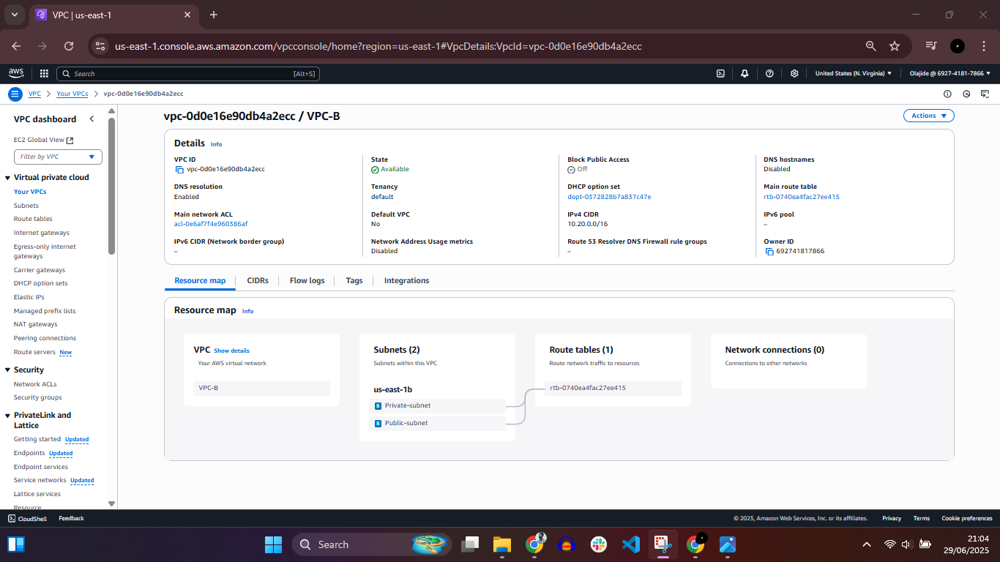
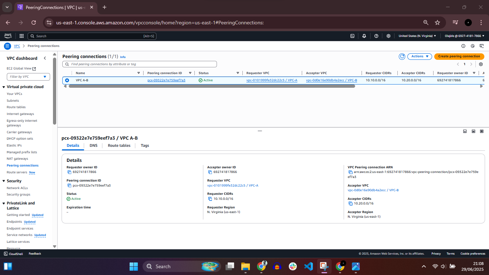
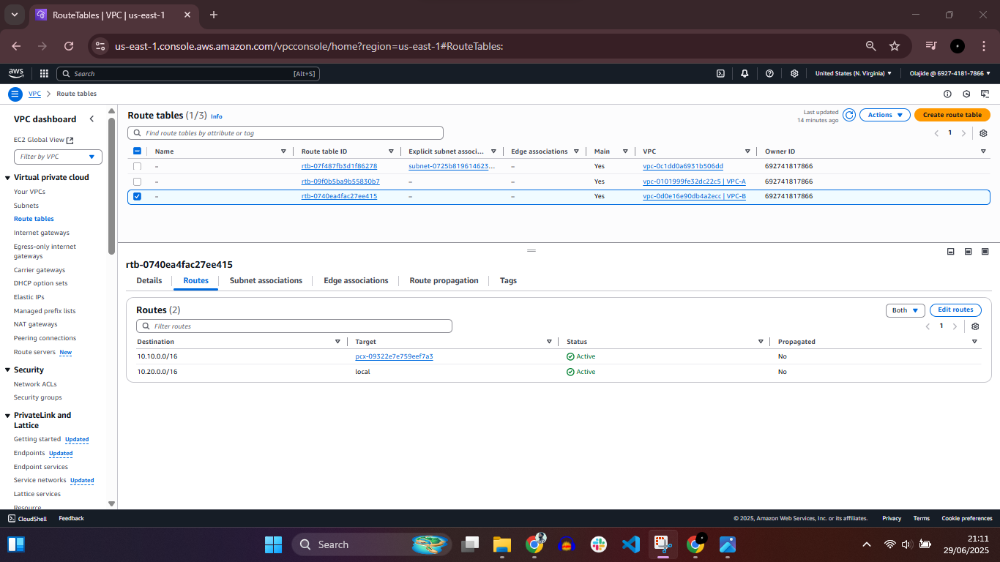

# VPC Peering Configuration Between Two VPCs

## 📌 Project Overview
This project demonstrates the creation of two separate Amazon Virtual Private Clouds (VPCs) and the configuration of **VPC Peering** to enable private communication between them.

Each VPC was configured with its own CIDR block, public subnet, and private subnet. Route tables were updated in both VPCs to allow traffic flow through the peering connection.

---

## 🛠️ Services Used
- Amazon VPC
- VPC Peering
- Route Tables
- Subnets

---

## 📋 Task Summary
- Created **VPC-A** with CIDR block `10.10.0.0/16`
- Created **VPC-B** with CIDR block `10.20.0.0/16`
- Created one **public subnet** and one **private subnet** in each VPC
- Established a **VPC peering connection** between VPC-A and VPC-B
- Updated route tables in both VPCs to allow inter-VPC traffic via the peering connection

---

## 🌐 Network Architecture

### VPC-A
- CIDR Block: `10.10.0.0/16`
- Public Subnet
- Private Subnet

### VPC-B
- CIDR Block: `10.20.0.0/16`
- Public Subnet
- Private Subnet

---

## 🔁 VPC Peering Details
- Peering established between VPC-A and VPC-B
- Enables private IP communication between both VPCs
- No overlapping CIDR blocks

---

## 🧭 Route Table Configuration
Route tables in both VPCs were updated to include routes that direct traffic destined for the peer VPC CIDR block through the VPC peering connection.

---

## 📸 Screenshots Evidence

### 1️⃣ VPC-A Configuration

### 2️⃣ VPC-B Configuration

### 3️⃣ VPC Peering Connection

### 4️⃣ Route Table – VPC-A

### 5️⃣ Route Table – VPC-B

---

## 🎯 Key Learnings
- Designing isolated networks using Amazon VPC
- Understanding CIDR block allocation
- Implementing VPC peering for cross-VPC communication
- Configuring route tables for controlled traffic flow

---

## 🚀 Use Case
This setup is commonly used for:
- Multi-environment architectures (e.g., dev and prod)
- Cross-account or cross-VPC communication
- Secure internal service connectivity

---

